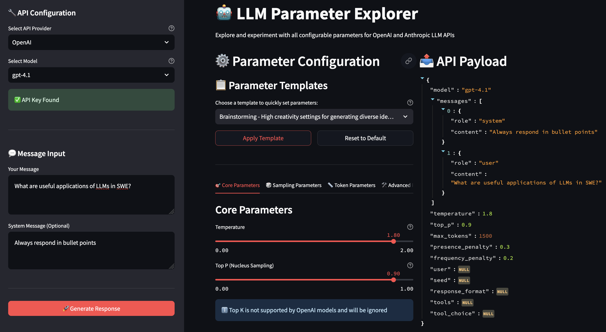

# LLM Parameter Explorer



A comprehensive Streamlit application that allows you to explore and experiment with all configurable parameters for OpenAI and Anthropic LLM APIs.

## Features

- **Dual API Support**: Switch between OpenAI and Anthropic APIs
- **Complete Parameter Control**: Modify every configurable parameter including:
  - Core parameters (temperature, top_p, top_k)
  - Sampling parameters (presence_penalty, frequency_penalty, seed)
  - Token parameters (max_tokens, stop_sequences)
  - Advanced parameters (user, metadata)
  - Response format options (JSON, text, tools)
- **Real-time Payload Preview**: See exactly what payload will be sent to the API
- **Response History**: Track and compare different API calls
- **Usage Analytics**: Monitor token usage and costs
- **Cost Calculation**: Real-time cost tracking with detailed breakdowns
- **Error Handling**: Clear error messages and debugging information

## Setup

1. **Install Dependencies**:
   ```bash
   pip install -r requirements.txt
   ```

2. **Set up API Keys**:
   Create a `.env` file in the `day2` directory with your API keys:
   ```
   # OpenAI API Key
   # Get your API key from: https://platform.openai.com/api-keys
   OPENAI_API_KEY=your_openai_api_key_here
   
   # Anthropic API Key  
   # Get your API key from: https://console.anthropic.com/
   ANTHROPIC_API_KEY=your_anthropic_api_key_here
   ```

3. **Run the Application**:
   ```bash
   streamlit run llm_parameter_explorer.py
   ```

## Usage

1. **Select API Provider**: Choose between OpenAI or Anthropic
2. **Choose Model**: Select from available models for your chosen provider
3. **Enter Message**: Type your message and optional system prompt
4. **Configure Parameters**: Use the tabs to adjust all available parameters:
   - **Core Parameters**: Temperature, Top P, Top K
   - **Sampling Parameters**: Presence/Frequency Penalties, Seed
   - **Token Parameters**: Max Tokens, Stop Sequences
   - **Advanced Parameters**: User ID, Metadata
   - **Response Format**: JSON, Text, Tools
5. **Generate Response**: Click the generate button to make the API call
6. **Review Results**: See the response, usage metrics, cost breakdown, and full API details

## Parameter Explanations

### Core Parameters
- **Temperature**: Controls randomness (0 = deterministic, 1 = very random)
- **Top P**: Nucleus sampling - controls diversity by considering only the most likely tokens
- **Top K**: Limits the number of tokens considered for each step

### Sampling Parameters
- **Presence Penalty**: Penalizes new tokens based on whether they appear in the text so far
- **Frequency Penalty**: Penalizes new tokens based on their frequency in the text so far
- **Seed**: Random seed for reproducible results (OpenAI only)

### Token Parameters
- **Max Tokens**: Maximum number of tokens to generate
- **Stop Sequences**: Sequences that will stop generation (Anthropic only)

### Advanced Parameters
- **User ID**: A unique identifier representing your end-user
- **Metadata**: Optional metadata object (Anthropic only)

### Response Format
- **Response Format**: Specify JSON or text output (OpenAI only)
- **Tools**: Enable function calling with custom tools (OpenAI only)

## Cost Tracking

The application includes comprehensive cost tracking features:

- **Real-time Cost Calculation**: Automatically calculates costs based on token usage
- **Cost Breakdown**: Shows input and output costs separately with per-1K-token rates
- **Cost Summary**: Tracks total costs across all API calls in the session
- **Model-specific Pricing**: Uses up-to-date pricing from `model_costs.csv`

The cost data is stored in `model_costs.csv` and can be updated with current model pricing.
